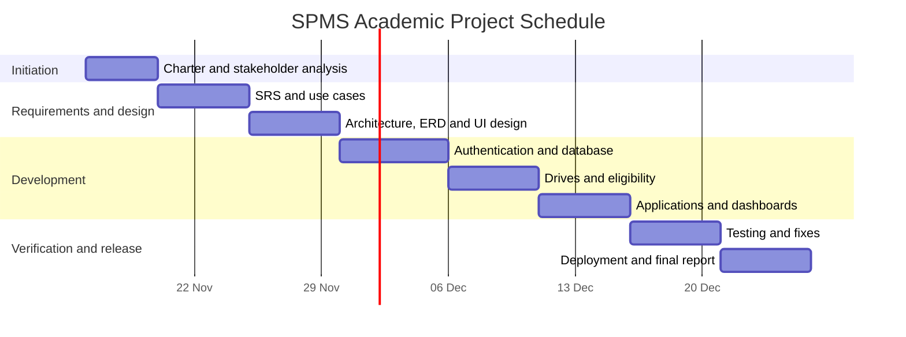

# Six-week Gantt-style schedule

```mermaid
gantt
  title SPMS Academic Project Schedule
  dateFormat YYYY-MM-DD
  axisFormat %d %b
  section Initiation
  Charter and stakeholder analysis :a1, 2026-11-16, 4d
  section Requirements and design
  SRS and use cases :a2, after a1, 5d
  Architecture, ERD and UI design :a3, after a2, 5d
  section Development
  Authentication and database :a4, after a3, 6d
  Drives and eligibility :a5, after a4, 5d
  Applications and dashboards :a6, after a5, 5d
  section Verification and release
  Testing and fixes :a7, after a6, 5d
  Deployment and final report :a8, after a7, 5d
```

**Note:** Dates are an illustrative baseline; replace them with your course's actual start date, submission deadline and team availability.
