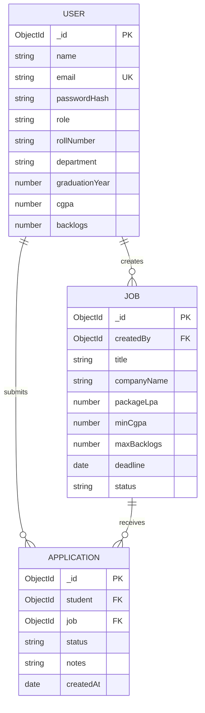

# Entity Relationship Diagram

```mermaid
erDiagram
  USER ||--o{ JOB : creates
  USER ||--o{ APPLICATION : submits
  JOB ||--o{ APPLICATION : receives
  USER {
    ObjectId _id PK
    string name
    string email UK
    string passwordHash
    string role
    string rollNumber
    string department
    number graduationYear
    number cgpa
    number backlogs
  }
  JOB {
    ObjectId _id PK
    ObjectId createdBy FK
    string title
    string companyName
    number packageLpa
    number minCgpa
    number maxBacklogs
    date deadline
    string status
  }
  APPLICATION {
    ObjectId _id PK
    ObjectId student FK
    ObjectId job FK
    string status
    string notes
    date createdAt
  }
```
