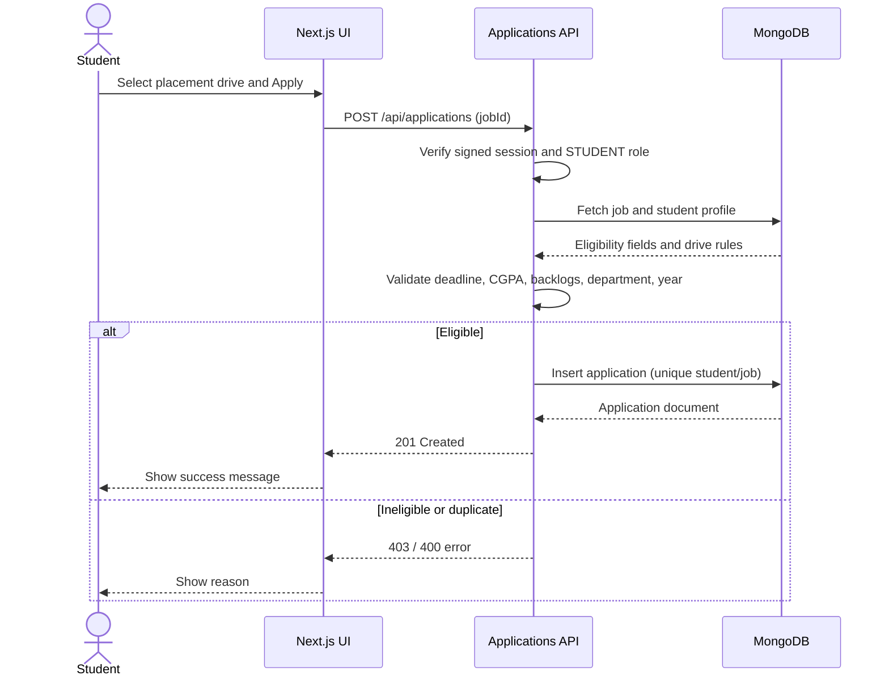

# Sequence Diagram — Student Application

```mermaid
sequenceDiagram
  actor Student
  participant UI as Next.js UI
  participant API as Applications API
  participant DB as MongoDB
  Student->>UI: Select placement drive and Apply
  UI->>API: POST /api/applications (jobId)
  API->>API: Verify signed session and STUDENT role
  API->>DB: Fetch job and student profile
  DB-->>API: Eligibility fields and drive rules
  API->>API: Validate deadline, CGPA, backlogs, department, year
  alt Eligible
    API->>DB: Insert application (unique student/job)
    DB-->>API: Application document
    API-->>UI: 201 Created
    UI-->>Student: Show success message
  else Ineligible or duplicate
    API-->>UI: 403 / 400 error
    UI-->>Student: Show reason
  end
```
